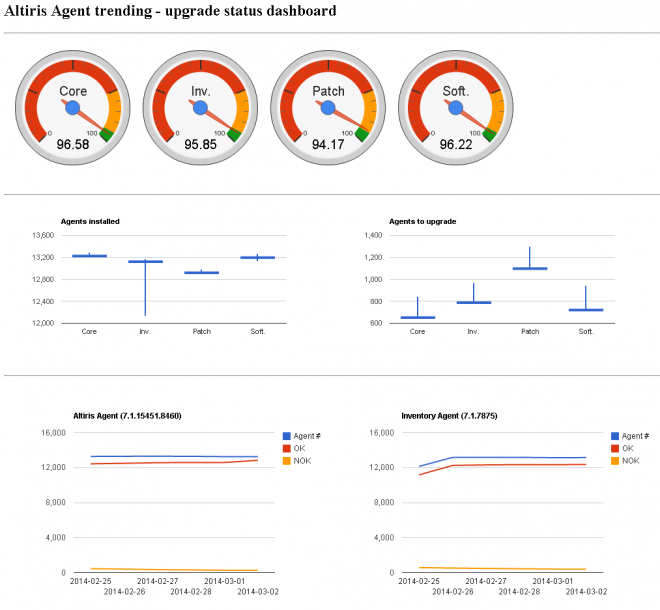

# {CWoC} Agent Monitoring Data Handler and Web-UI

---

Original Connect Article: [{CWoC} Agent Monitoring Data Handler and Web-UI](https://www.symantec.com/connect/downloads/cwoc-agent-monitoring-data-handler-and-web-ui)

---

## Table of content

- [Introduction](#Introduction)
- [Data handler design](#Data-handler-design)
- [Data handler usage](#Data-handler-usage)
- [Web-UI design](#Web-UI-design)
- [Web-UI sample](#Web-UI-sample)
- [Package details](#Package-details)
- [Conclusions](#Conclusions)
- [References](#References)

## Introduction
In an on-going effort to monitor and control the Altiris Agent upgrade after installing a rollup for example, I have produced and published here on Connect [1] a stored procedure to track the Agent Upgrade Status over time. The procedure stores data into a custom table name Trend_AgentVersions that can be used in the SMP console via custom report, however this is not necessarily the most appealing manner to display such data.

In this download we provide an executable that retrieves data from the Symantec CMDB and output it to the command line. We also provide a set of pages to build up a web-interface to display the charts on the console or in a custom site.

## Data handler design
In order to consume the data stored in the Symantec CMDB via a web-ui we need to either provide a dynamic interface or a tool to extract the information. Given we collect the data at interval that is (normally) no shorter than 23 hours it doesn't make sense to write a dynamic web-interface.

So the data handling is written into a stand alone executable file that contains the a data handler class to extract the data and a formatter class to output the data in java script format.

In order to not impose limits based on file names the tool does not output the results to a file, rather it prints it to the standard output (stdout). The consumer can then define where the data will be saved using simple console redirection (>).

## Data handler usage
The data handler runs with no parameters, however the standard `--help`, `-h`, `--version` and `-v` command line options are available to print out a brief help message or version details to the user.

Here is the output of both command lines:

```
Usage: AgentsMonitoring  [Parameter]

Parameters:
    -h, --help              Show this help message
    -v, --version           Output program version only

This program will output to the console (stdout) a Javascript file containing Agent Monitoring data to be consumed by a web-interface.
```

```
AgentsMonitoring version 1.

Built for .Net 2.0, brought to you by {CWoC}.
```

## Web-UI design
The web interface provided here is build from 3 different pages that were written for consumption inside the Symantec Management Console, and uses the Google Charts API to draw visually appealing controls:

- A page showing Agent Version up-to-date status in % using the Gauge controls
- A page showing agent data changes per agent type using the Candle stick control
- A page showing detailed status over time using the Line charts control.
- A page display the content of the 3 above pages using iframes

The design is kept a simple as possible, but the data and UI separation allows user customisation without any problems.

## Web-UI sample
You can integrate the view into the SMP console or you can access them directly.

Here is a short view of each pages. Note that the package comes with sample data so you can test the pages right away.

### Gauge control view:


### Candlestick control view:


### Line chart control view:


### Aggregate view:


## Package details
The package provides the file ready to use in an application directory named CWoC. Here is the file list and their path:

| File name | File path | Description |
|-----------|-----------|-------------|
| - | CWoC\ |The application directory. |
| AgentsMonitoring.exe | CWoC\AgentsMonitoring\ | The data handler executable file. This is a c# application. |
| run.bat| CWoC\AgentsMonitoring\ | A batch file to run the data handler and save the output in the agent_trending_data.js file in its web directory. It should be run from this directory. |
| - | CWoC\Web\ | The web-directory that contains user interface files (this should be used to create a virtual directory name CWoC on IIS. |
| index.html | CWOc\Web\AgentsTrending\ | The aggregate page that display each of the html pages below. |
| agent_trending_data.js | CWoC\Web\AgentsTrending\ | The data file that contains all the required javascript tables and options. |
| agent_monitoring_candlesticks | CWoC\Web\AgentsTrending\ | The candle stick visuaslisation page. |
| agent_monitoring_gauges | CWoC\Web\AgentsTrending\ | The gauge visualization page. |
| agent_monitoring_line-charts | CWoC\Web\AgentTrendings | The line chart visualization page. |
 
If you have configured the CWoC virtual directory at the root of the web-site (which is what I recommand) you can now access the data at:

- http://localhost/CwoC/AgentsTrending/

## Conclusion
You can now monitor the agent upgrade status over time and display the resulting data in a nice and efficient manner. This can help you highlight how well the environment is managed or pin-point problems if the data falls out of line with expectations.

## References

- [1] [Agent SQL](/docs/AGENTSQL.md)
- [1] [A Stored Procedure to Monitor Agent Upgrade Status Over-Time](https://www-secure.symantec.com/connect/articles/stored-procedure-monitor-agent-upgrade-status-over-time)